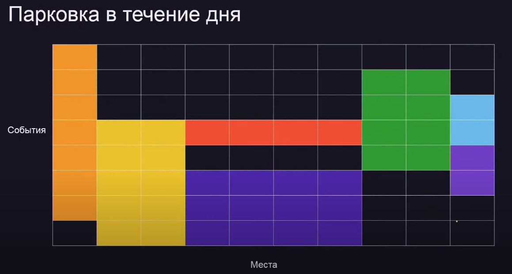

# Тема: «Сортировка событий»

## 1. Сортировка событий

### Что такое сортировка событий

* Пусть есть некоторые отрезки во времени (например, отрезок когда человек нанодился не сайте, т.е. известно его время входа и выхода)

* Что-то интересное происходит только в те моменты, когда человек приходит или уходит - события

* Надо что-нибудь посчитать

> ✅ task_1.py 

> ✅ task_2.py 

> ✅ task_3.py 

## 2. События на круге

### Что такое события на круге

* Самый простой пример — ежедневно происходящие события 

* Круг — это сутки 

* Идея: разрезать отрезки, проходящие через полночь, на два 

## 3. Два прохода

> ✅ task_4.py 

> ✅ task_5.py 

> ✅ task_6.py 