# Тема: «Деревья»

## 1. Собственный менеджер памяти

### Менеджмент памяти

* У нас есть заранее **неизвестное** количество структур с двумя ссылками на другие структуры

* Мы знаем заранее, какое **максимальное** количество структур может существовать одновременно

* Хотим научиться **выделять и освобождать** память

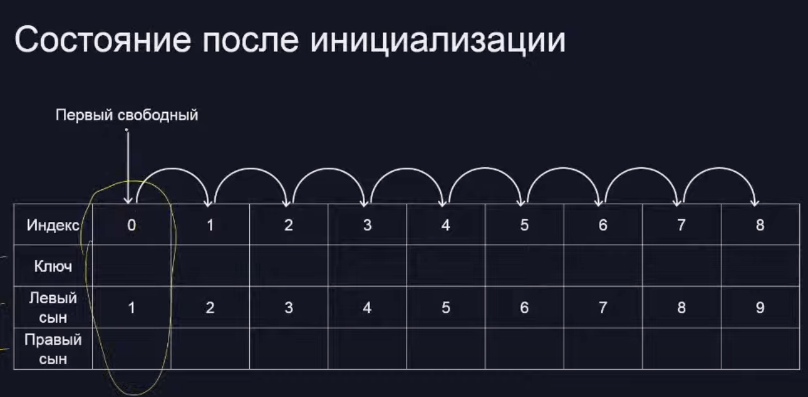

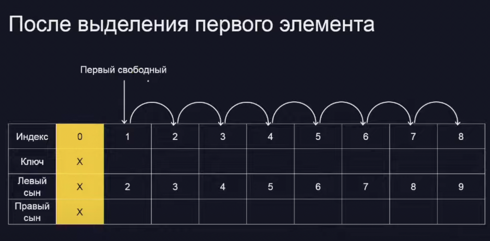

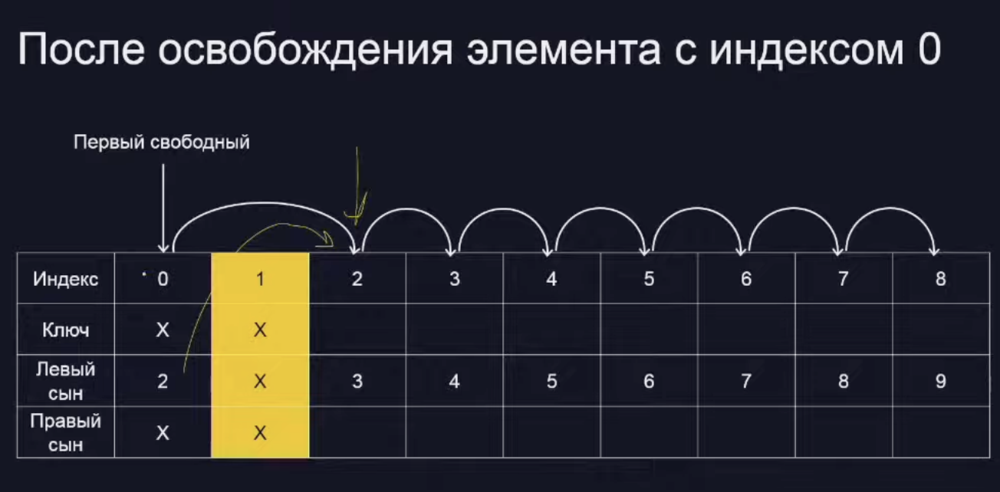

> ✅ task_0.py 

## 2. Бинарное дерево поиска

### Что такое бинарное дерево поиска

* У каждого узла есть ключ и два сына — левый и правый

* В левом поддереве ключи меньше, а в правом — больше

* Если ключи поступают в случайном порядке, то глубина дерева будет **O(log N)** --> k = 1 + 2 + ... + 2^k = 2^k+1 - 1

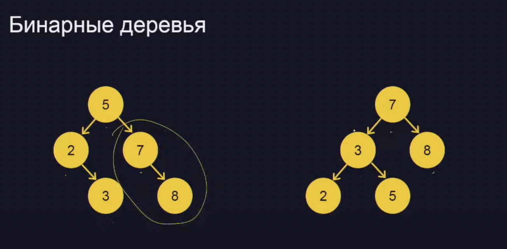

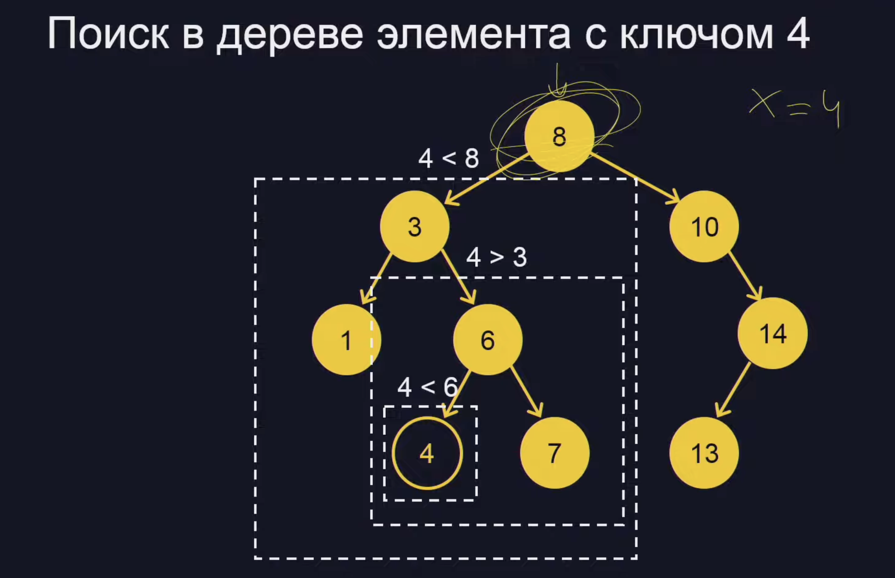

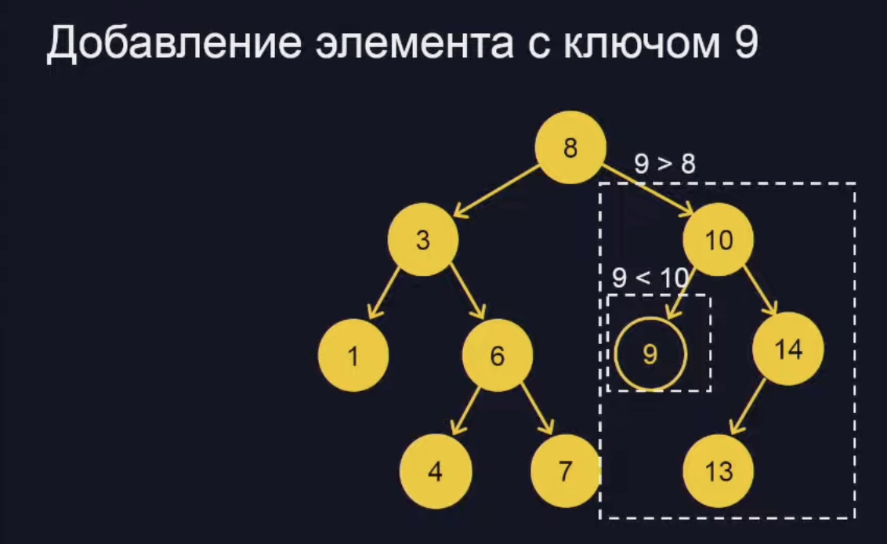

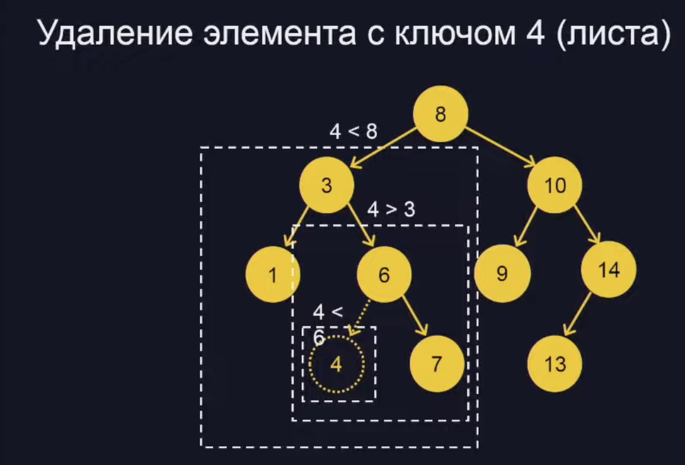

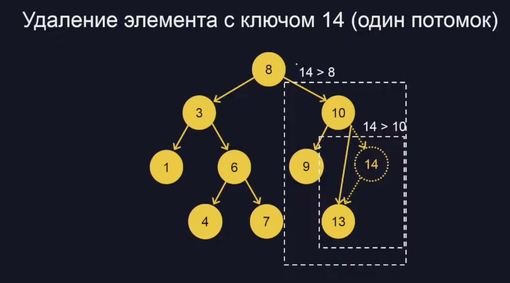

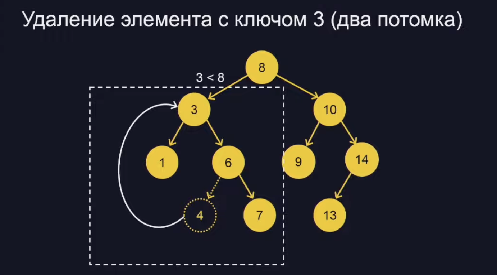

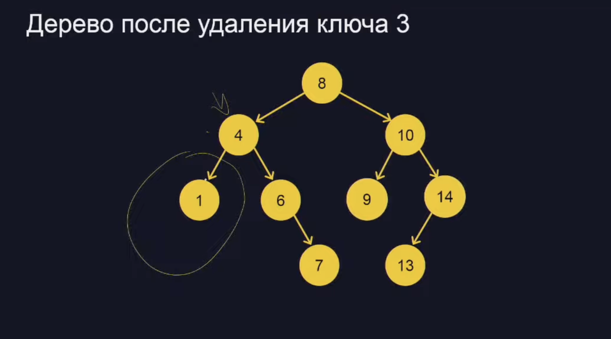

> ✅ task_1.py 

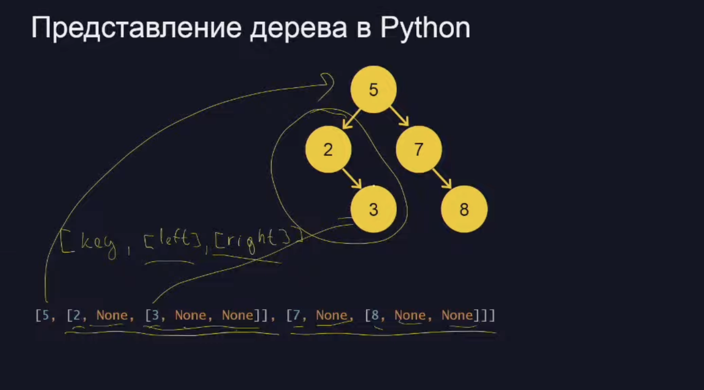

## 3. Обход деревьев

### Не бинарные деревья

* У узлов дерева может быть больше двух сыновей, тогда их нужно хранить **списком**

* **Примеры:** дерево каталогов и файлов, html-документы (DOM-дерево), дерево классов в программе и т.д.

* Обходим также как и бинрное, просто запуская **рекурсивную функцию** для всех детей

### Сериализация дерева Хаффмана

* Алгоритм Хаффмана позволяет сопоставить более часто встречающимся символам болев короткий код

* Каждый раз берем два самых редко встречающихся символа и объединяем их в один узел

* Строим бинарное дерево, кладем буквы в листья. Переход в левого сына кодируетса числом О, в правого -1, а код символа - это все ребра на пути от корня до листа

* В примере буква «а» встречается 4 раза, «б» — 3 раза, а «в» и «г» по одному разу

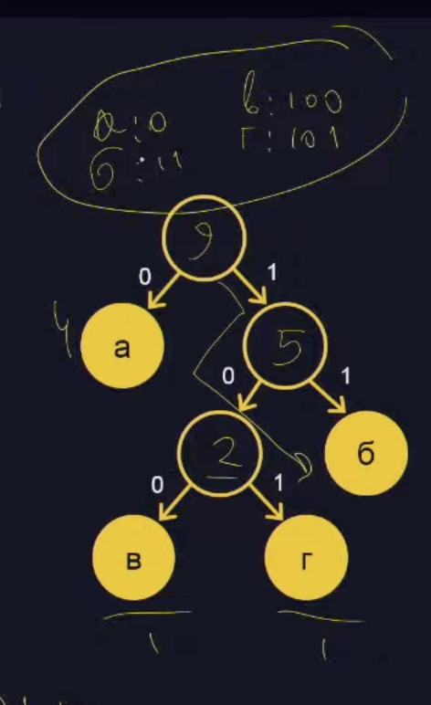

### Как сохранить структуру дерева ввиде строки?

* L — в левого ребёнка, R — в правого, U — в предка.
> **LURLLURUURUU**

* D — в наиболее левого непосещённого ребенка (детей всегда либо два, либо ноль)
> **DUDDDUDUUDUU**

* Теперь U означает, что мы поднимаемся вверх до тех пор, пока приходимиз правого ребенка. Если пришли в вершину из левого — сразу пойдем в правого
> **DUDDUU**

### Востановление дерева по записи

* D — в наиболее левого непосещённого ребенка (детей всегда либо два, либо ноль) 

* U — поднимаемся вверх до тех пор, пока приходим из правого ребенка. Если пришли в вершину из левого — сразу пойдем в правого

> **DUDDUU**

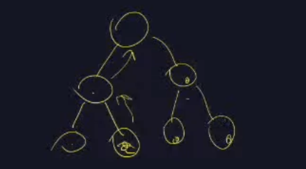

> ✅ task_2.py 